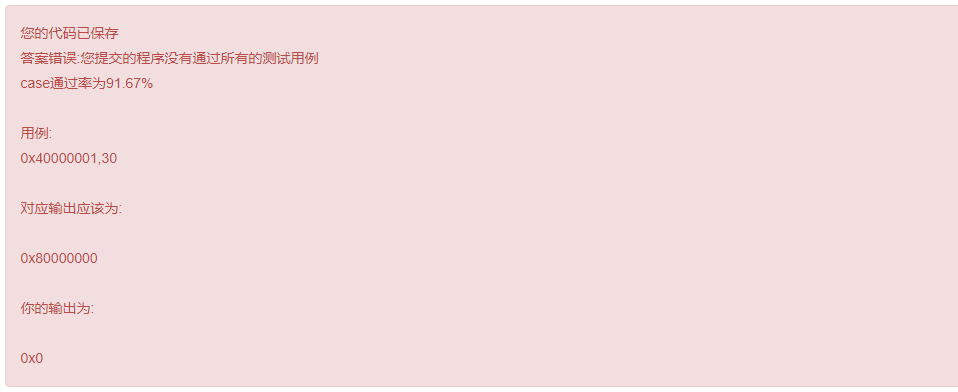

# 深信服试卷


## 一、深信服A卷（AK）

- 岗位：c/c ++软件开发A卷

[试卷传送门](https://www.nowcoder.com/test/23090658/summary)


别人关于这套试卷的[总结](https://blog.csdn.net/qq_21050645/article/details/105970529)

### 1、围棋遍历(BFS)

[题目传送门](https://www.nowcoder.com/questionTerminal/2242f11982e44881b749d9d188f0ccf5)


#### （1）别人AC的代码

注：看到auto，他的是C++11语法，不能用C++98

```cpp
#include <stdio.h>
#include <string.h>
#include <bits/stdc++.h>
using namespace std;
 
enum color {
    NONE, WHITE, BLACK,         //棋子颜色，NONE表示未落子
};
struct weiqi {
    enum color board[19][19];   //棋盘上每个位置的落子
};
 
int calc(struct weiqi *wq, int x, int y)
{
    //TODO:（代码要写的地方）
    int row = y, col = x;
    enum color co = wq->board[row][col];
    if(co == NONE){
        return 0;
    }
    vector<vector<int> > dirs = {{0, 1}, {1, 0}, {0, -1}, {-1, 0}};
    queue<vector<int> > q;
    q.push(vector<int>{row, col});
    int cnt = 1;
    wq->board[row][col] = NONE;
    while(!q.empty()){
        auto n = q.front();
        q.pop();
        for(auto d : dirs){
            int r = n[0] + d[0], c = n[1] + d[1];
            if(r < 0 || r >= 19 || c < 0 || c >= 19 || wq->board[r][c] != co){
                continue;
            }
            q.push(vector<int>{r, c});
            cnt++;
            wq->board[r][c] = NONE;
        }
    }
    return cnt;
}
int input(struct weiqi *wq, int *x, int *y)
{
    int row, col;
    int ret;
    char buf[80];
     
    for (row = 0; row < 19; ++row) {
        if (fgets(buf, sizeof(buf), stdin) == NULL)
            return -1;
        if (strlen(buf) < 19)
            return -1;
        for (col = 0; col < 19; ++col) {
            switch (buf[col]) {
            case '0':
                wq->board[row][col] = NONE;
                break;
            case '1':
                wq->board[row][col] = WHITE;
                break;
            case '2':
                wq->board[row][col] = BLACK;
                break;
            default:
                return -1;
            }
        }
    }
    ret = fscanf(stdin, "%d,%d\n", x, y);
    if (ret != 2)
        return -1;
    for (row = 0 ; row < 19; ++row) {
        for (col = 0; col < 19; ++col) {
            fprintf(stderr, "%d ", wq->board[row][col]);
        }
        fprintf(stderr, "\n");
    }
    fprintf(stderr, "x = %d, y = %d\n", *x, *y);
    return 0;
}
 
int main()
{
    struct weiqi wq;
    int x = 0, y = 0;
    int cnt;
 
    memset(&wq, 0, sizeof(wq));
    if (input(&wq, &x, &y) < 0) {
        fprintf(stderr, "error!\n");
        return 1;
    }
    cnt = calc(&wq, x, y);
 
    printf("%d\n", cnt);
    return 0;
}

```

#### （2）我的BFS代码，用的递归编程技巧

```cpp
#include <stdio.h>
#include <string.h>

enum color {
    NONE, WHITE, BLACK,         //棋子颜色，NONE表示未落子
};
struct weiqi {
    enum color board[19][19];   //棋盘上每个位置的落子
};

//---------------------------------------------------- 
int test[19][19];//辅助BFS，用于剪枝
void BFS(struct weiqi *wq, int x, int y,int &res, int val)
{
    if((x<0)||(y<0)||(x>18)||(y>18))
    return ;
    
    if(val!=(wq->board[y][x]))
	return ;
	
	if(test[y][x]==0&&val==(wq->board[y][x]))
	{
		res++;
		test[y][x]=1;
	}
	else
	{
		return;
	}
    
    BFS(wq, x, y-1,res, val);//上 
    BFS(wq, x, y+1,res, val);//下 
    BFS(wq, x-1, y,res, val);//左 
    BFS(wq, x+1, y,res, val);//右 
    
    return ;
}
 
int calc(struct weiqi *wq, int x, int y)
{
    //TODO:
    int res=0;
    int val = wq->board[y][x];//坑的地方 
    if(val==0)//特殊情况 
    {
    	return 0;
	}
    
	BFS(wq, x, y,res, val);
	return res; 
}
//------------------------------------------------------------------------
int input(struct weiqi *wq, int *x, int *y)
{
    int row, col;
    int ret;
    char buf[80];
    
    for (row = 0; row < 19; ++row) {
        if (fgets(buf, sizeof(buf), stdin) == NULL)
            return -1;
        if (strlen(buf) < 19)
            return -1;
        for (col = 0; col < 19; ++col) {
            switch (buf[col]) {
            case '0':
                wq->board[row][col] = NONE;
                break;
            case '1':
                wq->board[row][col] = WHITE;
                break;
            case '2':
                wq->board[row][col] = BLACK;
                break;
            default:
                return -1;
            }
        }
    }
    ret = fscanf(stdin, "%d,%d\n", x, y);
    if (ret != 2)
        return -1;
    for (row = 0 ; row < 19; ++row) {
        for (col = 0; col < 19; ++col) {
            fprintf(stderr, "%d ", wq->board[row][col]);
        }
        fprintf(stderr, "\n");
    }
    fprintf(stderr, "x = %d, y = %d\n", *x, *y);
    return 0;
}

int main()
{
    struct weiqi wq;
    int x = 0, y = 0;
    int cnt;

    memset(&wq, 0, sizeof(wq));
    if (input(&wq, &x, &y) < 0) {
        fprintf(stderr, "error!\n");
        return 1;
    }
    cnt = calc(&wq, x, y);

    printf("%d\n", cnt);
    return 0;
}

```

#### （3）数据

```txt
0000000000000000000
0000011000000000000
0000001111000000000
0000001021000000000
0000001010100000000
0000000000000000000
0000000000000000000
0000000000000000000
0000000000000000000
0000000000000000000
0000000000000000000
0000000000000000000
0000000000000000000
0000000000000000000
0000000000000000000
0000000000000000000
0000000000000000000
0000000000000000000
0000000000000000000
5,1
```

#### （4）有用的经验


对于，C++，他给了我函数模块
还写了一个TODO


我就以为，只能在那个函数里面写，后面发现。。。（我提交之后，看别人的代码，发现他们有的————似乎也是这么做的）所以应该可以
我还可以在外面继续写其他函数。。。。还可以写全局变量。。。


这次的BFS，我AC掉了
本来想用队列和bool标记有没有被

PS：其实要是提交C语言啥的，，，，还没有这些模块啥的出来。。。。所以，应该上面的操作是合法的。


### 2、单链表排序（冒泡排序）

[传送门](https://www.nowcoder.com/questionTerminal/4ef1efe2e0a14cd1bff0ab2c92df5905)

这种题目，其实是面试中的基础题，需要很熟练

#### （1）别人AC的代码

```cpp
#include <stdio.h>
#include <malloc.h>
 
struct node {
    int val;
    struct node *next;
};
 
static void list_sort(struct node *head);
 
struct node *list_create(int arr[], int size)
{
    struct node *head = NULL;
    int i;
    for (i = size - 1; i >= 0; --i) {
        struct node *p = (struct node *)malloc(sizeof(struct node));
 
        p->val = arr[i];
        p->next = head;
        head = p;
    }
    return head;
}
static void list_print(struct node *head)
{
    for (; head; head = head->next) {
        printf("%d", head->val);
        if (head->next)
            printf(" ");
    }
    printf("\n");
}
static void list_free(struct node *head)
{
    struct node *next;
    while (head) {
        next = head->next;
        free(head);
        head = next;
    }
}
static int input(int **arr, int *size)
{
    int i;
    int ret;
 
    ret = fscanf(stdin, "%d\n", size);
    if (ret != 1)
        return -1;
    *arr = (int *)malloc(sizeof(int) * (*size));
    for (i = 0; i < *size; ++i) {
        fscanf(stdin, "%d ", &(*arr)[i]);
    }
    return 0;
}
 
int main(int argc, char *argv[])
{
    struct node *head;
    int *arr = NULL;
    int size = 0;
 
    if (input(&arr, &size) < 0) {
        fprintf(stderr, "input error\n");
        return 0;
    }
    head = list_create(arr, size);
    list_sort(head);
    list_print(head);
    list_free(head);
    free(arr);
    return 0;
}
 
void swap(node *p1, node *p2){
    int val = p2->val;
    p2->val = p1->val;
    p1->val = val;
}
 
static void list_sort(struct node *head)
{
    //TODO:
    if(head->next == NULL){
        return;
    }
 
    struct node *p1, *p2;
    struct node *end = NULL;
    while(head->next != end){
        p1 = head;
        p2 = head->next; 
        while(1){
            if(p1->val > p2->val){
                swap(p1, p2);
            }
            p1 = p1->next;
            p2 = p2->next;
            if(end == NULL && p2 == NULL){
                break;
            }else if(p2 == end){
                break;
            }
        }
        end = p1;
    }
}


```

#### 另一种解法

```cpp
#include <stdio.h>
#include <malloc.h>
 
struct node {
    int val;
    struct node *next;
};
 
static void list_sort(struct node *head);
 
struct node *list_create(int arr[], int size)
{
    struct node *head = NULL;
    int i;
    for (i = size - 1; i >= 0; --i) {
        struct node *p = (struct node *)malloc(sizeof(struct node));
 
        p->val = arr[i];
        p->next = head;
        head = p;
    }
    return head;
}
static void list_print(struct node *head)
{
    for (; head; head = head->next) {
        printf("%d", head->val);
        if (head->next)
            printf(" ");
    }
    printf("\n");
}
static void list_free(struct node *head)
{
    struct node *next;
    while (head) {
        next = head->next;
        free(head);
        head = next;
    }
}
static int input(int **arr, int *size)
{
    int i;
    int ret;
 
    ret = fscanf(stdin, "%d\n", size);
    if (ret != 1)
        return -1;
    *arr = (int *)malloc(sizeof(int) * (*size));
    for (i = 0; i < *size; ++i) {
        fscanf(stdin, "%d ", &(*arr)[i]);
    }
    return 0;
}
 
int main(int argc, char *argv[])
{
    struct node *head;
    int *arr = NULL;
    int size = 0;
 
    if (input(&arr, &size) < 0) {
        fprintf(stderr, "input error\n");
        return 0;
    }
    head = list_create(arr, size);
    list_sort(head);
    list_print(head);
    list_free(head);
    free(arr);
    return 0;
}
 
static void list_sort(struct node *head)
{
    //TODO:
    node *h=head;
    node *a;
    node *ne;
    int temp=0;
    while(h){
        ne=h->next;
        while(ne){
            if(h->val>ne->val){
                temp=h->val;
                h->val=ne->val;
                ne->val=temp;
            }
            ne=ne->next;
        }
        h=h->next;
    }
     
}

```

#### （2）我的代码

```cpp
#include <stdio.h>
#include <malloc.h>

struct node {
    int val;
    struct node *next;
};

static void list_sort(struct node *head);

struct node *list_create(int arr[], int size)
{
    struct node *head = NULL;
    int i;
    for (i = size - 1; i >= 0; --i) {
        struct node *p = (struct node *)malloc(sizeof(struct node));

        p->val = arr[i];
        p->next = head;
        head = p;
    }
    return head;
}
static void list_print(struct node *head)
{
    for (; head; head = head->next) {
        printf("%d", head->val);
        if (head->next)
            printf(" ");
    }
    printf("\n");
}
static void list_free(struct node *head)
{
    struct node *next;
    while (head) {
        next = head->next;
        free(head);
        head = next;
    }
}
static int input(int **arr, int *size)
{
    int i;
    int ret;

    ret = fscanf(stdin, "%d\n", size);
    if (ret != 1)
        return -1;
    *arr = (int *)malloc(sizeof(int) * (*size));
    for (i = 0; i < *size; ++i) {
        fscanf(stdin, "%d ", &(*arr)[i]);
    }
    return 0;
}

int main(int argc, char *argv[])
{
    struct node *head;
    int *arr = NULL;
    int size = 0;

    if (input(&arr, &size) < 0) {
        fprintf(stderr, "input error\n");
        return 0;
    }
//     printf("OK\n");
    head = list_create(arr, size);
   
    list_sort(head);
    list_print(head);
    list_free(head);
    free(arr);
    return 0;
}

static void list_sort(struct node *head)
{
    //TODO:
     if (head == NULL)//无节点 
        return;

    struct node* tail = NULL;
    while (tail != head->next)//不满足则1个节点，否则>1个节点 
    {
        struct node* cur = head ;  

        while (cur->next != tail)
        {
            if (cur->val>cur->next->val)
            {   //交换节点
            
                cur->val = (cur->val)^(cur->next->val);
                cur->next->val = (cur->val)^(cur->next->val);
				cur->val = (cur->val)^(cur->next->val);
            }  
            
            cur = cur->next;
            
        }//#end while
        
        tail = cur;//前移 
       
    }//#end 最外层 while

    
}
```


### 3、出栈顺序

[传送门](https://www.nowcoder.com/questionTerminal/37dafde80fa2445d91f6d7ae18795668)

#### （1）方法一next_permutation

- 一个个排列筛选

```cpp
#include<stack>
#include<iostream>
#include<cstdio>
#include<algorithm>
using namespace std;
const int maxn=100000+5;

char test[maxn];
int num[maxn*2];//序列，1表示入栈，0表示出栈 
int tag=0;//多少个字符

void solution(char test[], int num[], int tag)
{
	stack<char> res;
	int temp=0;
	for(int i=1; i<=tag*2 ;i++)
	{
		if(num[i])
		{
			res.push(test[temp++]);
		}
		else
		{

			printf("%c",res.top());
			res.pop();
		}
	}
	
	printf("\n");
}


int demo()
{
	int input=0;
	int output=0;
	int k=1;
	while((input!=tag)&&(output!=tag))
	{
		if(k>2*tag)
		{
			return 0;
		}
		
		if(num[k]==1)
		{
			input++;
		}
		else
		{
			output++;
		}
		
		if(output>input)
		{
			return 0;
		}
		
		k++;
	}
	
	return 1;
}

int main()
{
	gets(test);
	for(int i=0; test[i]!='\0'; i++)
	{
		tag++;
	}

	for(int i=1; i<=2*tag ; i+=2)
	{
		num[i]=1;
	}
	
	solution(test, num, tag);
	while(next_permutation(num+1,num+2*tag+1))
	{
		if(demo())
		{
			solution(test, num, tag);
		}
		
	}
	//这种全排列的还不够好，还可以辅助卡特兰数进行break
	//	方法2：栈+DFS，然后在上面剪枝 
	//	printf("函数结束"); 
	
	return 0;
 } 

```

#### （2）方法2（栈+DFS+剪枝）（没有完成——）

```cpp
#include<stack>
#include<iostream>
#include<cstdio>
using namespace std;
const int maxn=100000+5;

char test[maxn];
int num[maxn*2];//序列，1表示入栈，0表示出栈 
int tag=0;//多少个字符
int input;
int output; 

int pre=0;//当前复赋值的点 
	
void solution(char test[], int num[], int tag)
{
	stack<char> res;
	int temp=0;
	for(int i=1; i<=tag*2 ;i++)
	{
		if(num[i])
		{
			res.push(test[temp++]);
		}
		else
		{

			printf("%c",res.top());
			res.pop();
		}
	}
	
	printf("\n");
}

//input余下的可以入栈的数
//output下的可以出栈的数
//tag是字母的数目 
void DFS(int input, int output)
{
	if((tag-input)>(tag-output)) //出 
	{
		pre++;
		num[pre]=0;
		output--;

		DFS(input, output);
	}
	
	if(input>0)//入 
	{
		pre++;
		num[pre]=1;
		input--;

		DFS(input, output);
	}
	
	if((num[pre]==0)&&(output==0))
	{
		solution(test, num, tag);
//		cout<<"OKKKKK"<<endl;
		pre--;
		output++;
		return;
	}
	


	if((num[pre]==0)&&(output!=0))
	{
		pre--;
		++output;
		return;
	}
	else if(num[pre]==1)
	{
		pre--;
		++input;
		return;
	}
	

}


int main()
{
	gets(test);
	for(int i=0; test[i]!='\0'; i++)
	{
		tag++;
	}
	
	input=tag;
	output=tag; 
	
	DFS(input, output);
	
	printf("函数结束"); 
	
	return 0;
 } 

```


## 二、深信服B卷（AK）


### 1.位对齐


##### （1）1.第一次提交（91.67对位运算和（进位）加减有偏差）

```cpp
#include<stdio.h>
unsigned int align_n(unsigned int size, int n)
{
	
	
	unsigned int test=(1<<n)-1;//第0-n位全是1 
	
	unsigned int temp=size;//复制 
	temp&=(~(test<<(32-n))); //获得第0-n位的位

	
	unsigned int out;
	
	if(temp&test)//如果有1 
	{

		size&=(~test);
		
//		printf("size=%d\n",size);
		out=size^(1<<n);
//		printf("OK");
		
		return out;
	}
	
	
	
	out=size&=(~test);;
	return out;
	
}

int main()
{
	unsigned int size,out;
	int n;
	scanf("0x%x,%d",&size,&n);
//	printf("size=%x,n=%d\n",size,n); 
	out=align_n(size,n);
	
	printf("0x%x",out); 
	return 0; 
} 

```



##### (2)2.第二次AC

```cpp
#include<stdio.h>
unsigned int align_n(unsigned int size, int n)
{
	
	
	unsigned int test=(1<<n)-1;//第0-n位全是1 
	
	unsigned int temp=size;//复制 
	temp&=(~(test<<(32-n))); //获得第0-n位的位

	
	unsigned int out;
	
	if(temp&test)//如果有1 
	{

		size&=(~test);//末尾置0 
		
//		printf("size=%d\n",size);
		if(size&(1<<n)) 
		{
//			printf("OK");//错在这里 
			
			out=size+(1<<n);
		}
		else
		{
			out=size^(1<<n);//错在这里 ,如果那个地方是0可以，要是1要进位 
		}
		
//		printf("OK");
		
		return out;
	}
	
	
	
	out=size&=(~test);;
	return out;
	
}

int main()
{
	unsigned int size,out;
	int n;
	scanf("0x%x,%d",&size,&n);
//	printf("size=%x,n=%d\n",size,n); 
	out=align_n(size,n);
	
	printf("0x%x",out); 
	return 0; 
} 

```


### 2.堆排序（代码填空题）—未解决

```cpp
#include <stdio.h>
#include <stdlib.h>
#include <assert.h>
static void heap_arrange(int arr[], int cur, int cnt);

static int heap_verify(int arr[], int cnt)
{
    int i;
    for (i = 0; i < cnt / 2; ++i) {
        int lhs = 2 * i + 1;
        int rhs = 2 * i + 2;
        
        if (lhs < cnt && arr[i] > arr[lhs]) {
            fprintf(stderr, "arr[%d]:%d > arr[%d]:%d\n", i, arr[i], lhs, arr[lhs]);
            return -1;
        }
        if (rhs < cnt && arr[i] > arr[rhs]) {
            fprintf(stderr, "arr[%d]:%d > arr[%d]:%d\n", i, arr[i], rhs, arr[rhs]);
            return -1;
        }
    }
    return 0;
}

static void heap_print(int arr[], int cnt)
{
    int layer = 0, num = 0;
    for (layer = 0; num < cnt; ++layer) {
        int i = 0;
        for (i = 0 ; i < (1 << layer) && num < cnt ; ++i)
            printf("%3d ", arr[num++]);
        printf("\n");
    }
}
static void heap_sort(int arr[], int cnt)
{
    int i;

    printf("origin:\n");
    heap_print(arr, cnt);
    //  建堆
    for (i = cnt / 2 - 1; i >= 0; --i) {
        heap_arrange(arr, i, cnt);
    }
    printf("make heap:\n", i);
    heap_print(arr, cnt);
    assert(heap_verify(arr, cnt) == 0);
    for (i = cnt - 1; i > 0; --i) {
        int tmp;
        tmp = arr[0];
        arr[0] = arr[i];
        arr[i] = tmp;
        printf("sort i=%d\n", i);
        heap_print(arr, cnt);
        heap_arrange(arr, 0, i);
        heap_print(arr, cnt);
        assert(heap_verify(arr, i) == 0);
    }
    printf("sorted:\n");
    heap_print(arr, cnt);
}
static int input(int **arr, int *size)
{
    int i;
    int ret;

    ret = fscanf(stdin, "%d\n", size);
    if (ret != 1)
        return -1;
    *arr = (int *)malloc(sizeof(int) * (*size));
    for (i = 0; i < *size; ++i) {
        fscanf(stdin, "%d ", &(*arr)[i]);
    }
    return 0;
}

int main(int argc, char *argv[])
{
    int *arr = NULL;
    int cnt = 0;
    int i;

    if (input(&arr, &cnt) < 0) {
        fprintf(stderr, "input error\n");
        return 0;
    }
    heap_sort(arr, cnt);
    return 0;
}
//  调整为小顶堆
static void heap_arrange(int arr[], int cur, int cnt)  //调整为小顶堆
{
    int heaptop_val = arr[cur]; //堆顶的值
    while (cur < cnt) {
        int left = 2 * cur + 1;
        int right = 2 * cur + 2;
        int min = -1;
        int min_val = heaptop_val;
        if (left < cnt && arr[left] < min_val) { //检查是否比左节点大
            min = left;
            min_val = arr[left];
        }
        if (right < cnt && arr[right] < min_val) {//检查是否比右节点大
            min = right;
        }
        if (min == -1)
            break;
        arr[cur] = arr[min];
        cur = min;
    }
    arr[cur] = heaptop_val;
}

```


### 3.最优二叉树（填空题）—未解决

```cpp
#include <stdio.h>
#include <limits.h>
#include <assert.h>
#include <malloc.h>

struct node {
    int left, right, parent;
    int val;
};

void tree_print(const struct node arr[], int cnt)
{
    int i;
    for (i = 0; i < cnt; ++i) {
        fprintf(stderr, "%d: {left:%d,right:%d,parent:%d,val:%d}\n"
            , i, arr[i].left, arr[i].right, arr[i].parent, arr[i].val);
    }
}

void tree_output(FILE *fp, const struct node arr[], int old_cnt, int cnt)
{
    int i;
    fprintf(fp, "```mermaid\n");
    fprintf(fp, "graph TD\n");
    for (i = 0; i < cnt; ++i) {
        if (i < old_cnt)
            fprintf(fp, "\tn%d[n%d:%d]\n", i, i, arr[i].val);
        else
            fprintf(fp, "\tn%d((%d))\n", i, arr[i].val);

        if (arr[i].parent >= 0) {
            fprintf(fp, "\tn%d --> n%d\n", i, arr[i].parent);
        }
    }
    fprintf(fp, "```\n");
}

int build_tree(struct node arr[], int cnt);

static int input(int **arr, int *size)
{
    int i;
    int ret;

    ret = fscanf(stdin, "%d\n", size);
    if (ret != 1)
        return -1;
    if (*size <= 0)
        return -1;
    *arr = (int *)malloc(sizeof(int) * (*size));
    for (i = 0; i < *size; ++i) {
        fscanf(stdin, "%d ", &(*arr)[i]);
    }
    return 0;
}
int main(int argc, char *argv[])
{
    int *vals = NULL;
    int cnt = 0;
    struct node *arr;
    int i;

    if (input(&vals, &cnt) < 0) {
        fprintf(stderr, "input error\n");
        return 0;
    }
    arr = (struct node *)malloc(sizeof(struct node) * cnt * 3);

    for (i = 0; i < cnt; ++i) {
        arr[i].left = -1;
        arr[i].right = -1;
        arr[i].parent = -1;
        arr[i].val = vals[i];
    }

    int newcnt = build_tree(arr, cnt);
    tree_output(stdout, arr, cnt, newcnt);
    free(vals);
    free(arr);
    return 0;
}

//  建树，返回树的根节点
int build_tree(struct node arr[], int cnt)
{
    while (1) {
        int i;
        int min1 = -1;              //权值最小的节点编号
        int min2 = -1;              //权值第二小的节点编号
        int root_node = 0;          //根节点(没有父节点)的个数

        for (i = 0; i < cnt; ++i) {
            if (arr[i].parent>= 0)    //拥有父节点,则跳过这个结点
                continue;
            ++root_node;        //根节点加1
            if (min1 < 0) {
                min1 = i;
            } else if (arr[i].val < arr[min1].val) {    //出现比第一更小的,更新
                min2 = min1;
                min1 = i;
            } else if (min2 < 0) {
                min2 = i;
            } else if (arr[i].val < arr[min2].val) {    //当前节点权值比第二小节点更小
                min2 = i;
            }
        }
        if (root_node < 2)
            break;
        arr[cnt].left = min2;
        arr[cnt].right = min1;
        arr[cnt].val = arr[min1].val + arr[min2].val;
        arr[cnt].parent = -1;
        arr[min1].parent = cnt;
        arr[min2].parent = cnt;
        ++cnt;
    }
    return cnt;
}

```


## 三、深信服C卷（1/3）


### 1.字符串匹配（递归）


```txt
看了别人的代码

发现，好久没有写代码。都没有考虑代码的健壮性

然后，看来他们的代码

感觉。自己对递归的思考还是没有很深刻。。。。

有人，还自己添加了头文件

还有人自己添加了一些函数，自行编写
```


- 我用的递归写的。

递归写法套路：

- 将函数抽象为已经实现了的，然后，在这个假设上面调用它
- 步步分情况分解问题，反正下一个问题不会，就给那个已知的递归函数
- 自己编写已知：也就是编写最终的最小问题解决方案。

> 深信服CK：暴力、递归？


```cpp
#include <stdio.h>
#include <string.h>
#include <malloc.h>

int match(const char *str, const char *pattern)
{
    //TODO:
    if( '\0'==str[0] && '\0'!=pattern[0] )
    {
        return -1;
    }
    
    if( '\0'!=str[0] && '\0'==pattern[0])
    {
        return -1;
    }
    
    if( '\0'==str[0] && '\0'==pattern[0] )
    {
    	return 0;
    }
    
    


    if( str[0]==pattern[0] || pattern[0]=='?')
    {
        return match( str+1, pattern+1 );
    }
    else if( '*'==pattern[0] )
    {
        //第1种，当成？
        int a=match( str+1, pattern+1 );
        //第2种
        int b=match( str+1, pattern);
        if( 0==a|| 0==b )
        {
            return 0;
        }
        else
        {
            return -1;
        }
        
    }
    else
    {
    	return -1;
    }
    
    

}

int input(char **src, char **ptn)
{
    char buf[10240];
    
    *src = NULL;
    *ptn = NULL;
    if (fgets(buf, sizeof(buf), stdin) == 0)
        goto failed_;
    *src = strdup(buf);
    if (fgets(buf, sizeof(buf), stdin) == 0)
        goto failed_;
    *ptn = strdup(buf);
    return 0;
failed_:
    if (*src)
        free(*src);
    if (*ptn)
        free(*ptn);
    *src = NULL;
    *ptn = NULL;
    return -1;
}

int main(int argc, char *argv[])
{
    char *src = NULL;
    char *ptn = NULL;
    
    if (input(&src, &ptn) < 0) {
        fprintf(stderr, "error\n");
        return 0;
    }

    if (match(src, ptn) == 0) {
        printf("match\n");
    } else {
        printf("unmatch\n");
    }
    return 0;
}
```


### 2.字符串解析


### 3.围棋数气


## 四、深信服D卷（余1题没AC）（无100的）

### 1.二进制位反序（位运算AC）

[传送门](https://www.nowcoder.com/questionTerminal/b6454cc72a4e4d178b76e31d319dff2d)

```cpp
#include <stdio.h>
#include <string.h>

unsigned int reverse(unsigned int num)
{
    //TODO:
    unsigned int ret=0;
	for(int i=0;i<32;++i)
	{
		unsigned int test=1<<i;
		if(num&test)
		{
			ret^=(1<<(31-i));
		}
		
	 } 
	 
	 return ret;
}

int main(int argc, char *argv[])
{
    unsigned int num = 0;
    unsigned int ret = 0;

    if (1 != fscanf(stdin, "0x%x", &num)) {
        fprintf(stderr, "input error\n");
        return 0;
    }
    ret = reverse(num);
    printf("%08x\n", ret);
    return 0;
}

```

### 2.统计累加算式（dpAC）


### 3.攻击识别（目前牛客没人AC-但有个过了3分之1点）

可能测试数据有误

